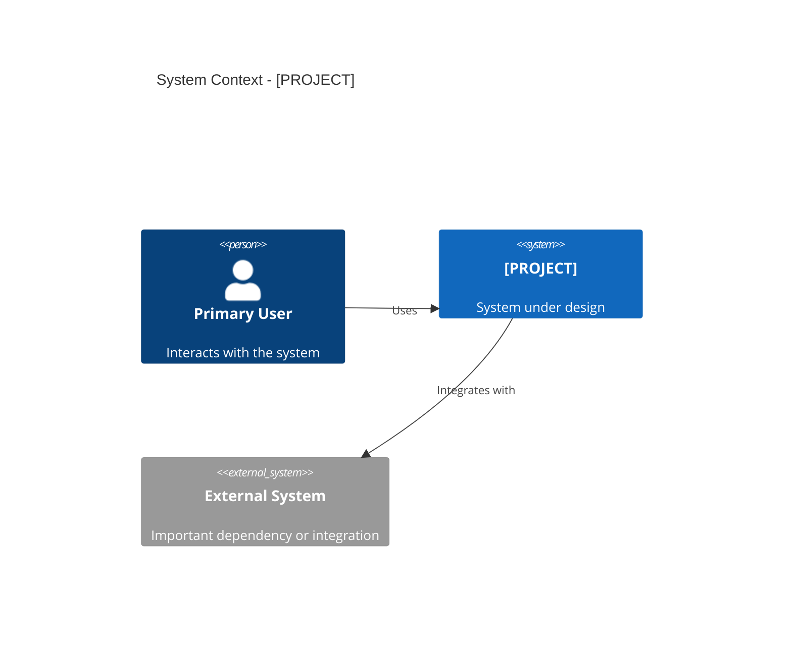
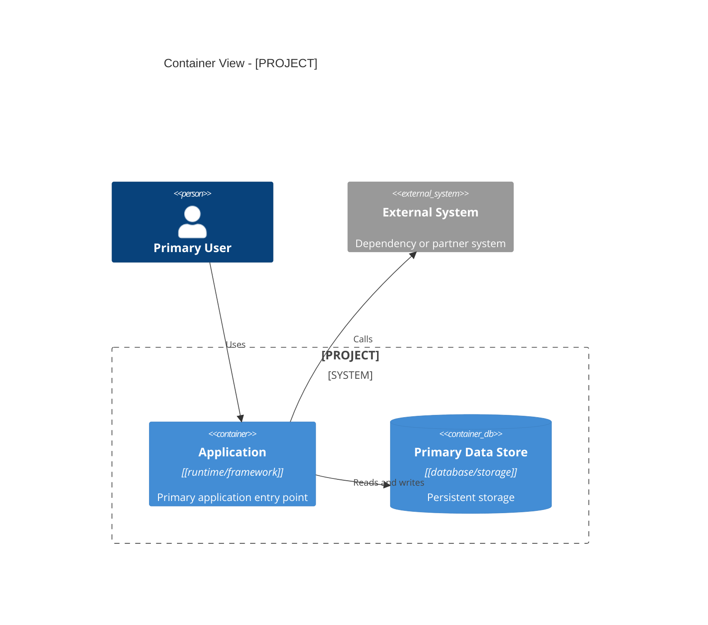
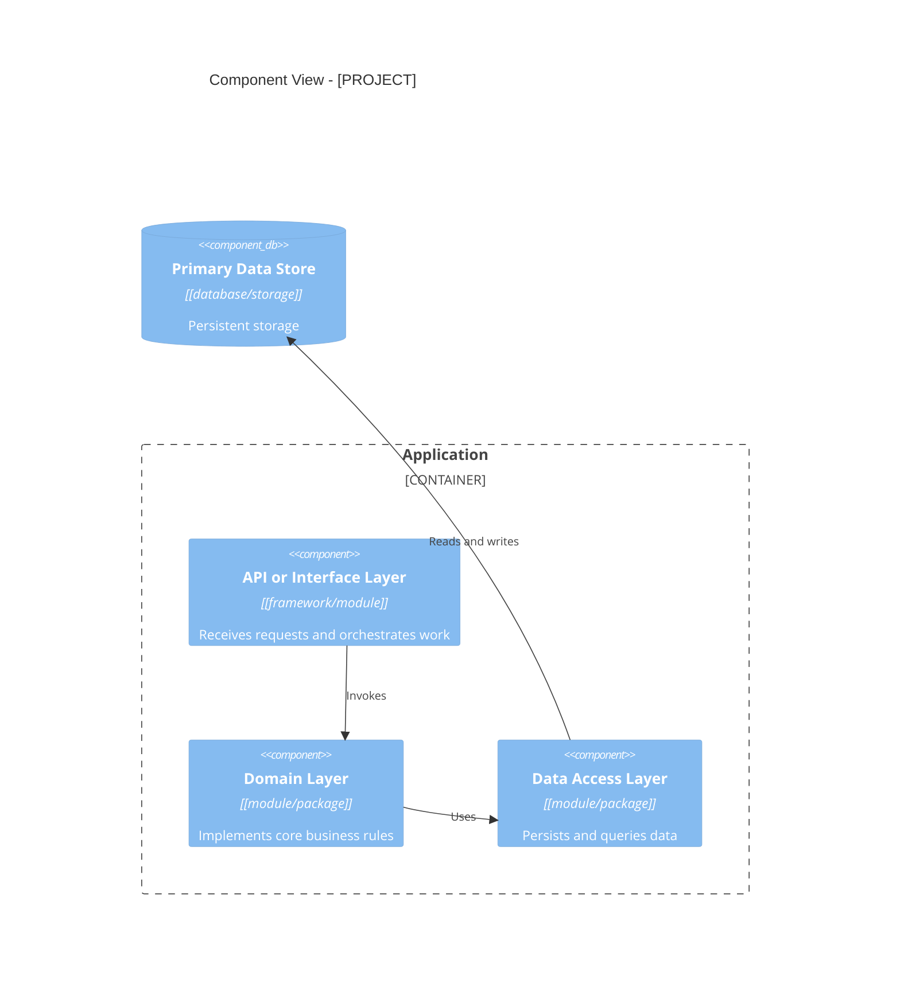
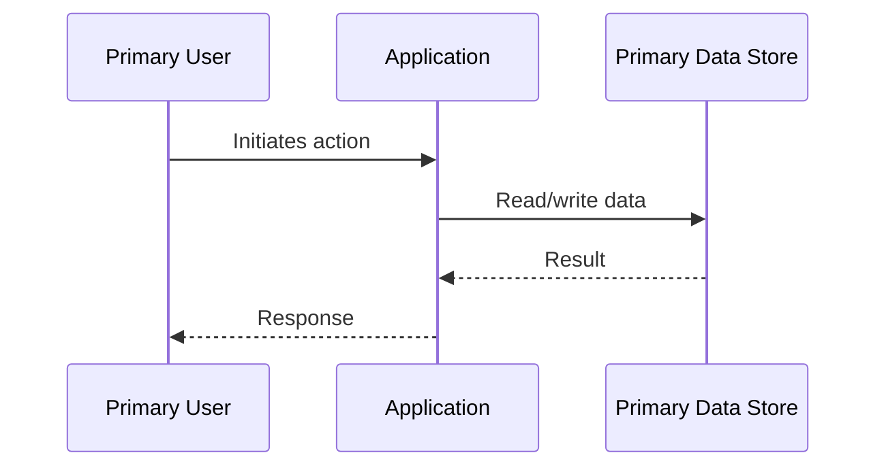
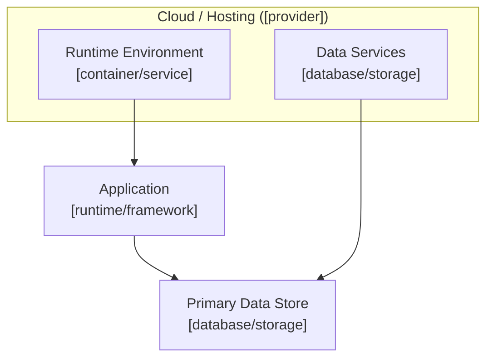

# Software Architecture Document: [PROJECT]

> Date: [DATE] | Status: Draft

## Purpose and Scope

[Summarize the system purpose, primary problem space, and boundary. Avoid meta statements about the document itself.]

## Technical Context

**Language/Version**: [e.g. TypeScript 5.8 or NEEDS CLARIFICATION]  
**Primary Dependencies**: [e.g. Next.js 15, FastAPI, React, Azure SDKs, or NEEDS CLARIFICATION] 
**Storage**: [e.g. PostgreSQL, Azure Cosmos DB, files, or N/A]  
**Testing**: [e.g. Vitest, pytest, Playwright, or NEEDS CLARIFICATION] 
**Target Platform**: [e.g. Linux containers on Azure, iOS 17+, desktop CLI]  
**Project Type**: [single service/web/mobile/platform/library] 
**Performance Goals**: [e.g. <250 ms p95 API latency, <2 s page interactive]  
**Constraints**: [e.g. regulated data, offline use, strict budget, vendor constraints]  
**Scale/Scope**: [e.g. 10k MAU, single-tenant pilot, multi-region growth target]

## System Scope and Context

[Describe the system boundary, primary users, external systems, and business or domain context.]

### C4 System Context

### C4 Container View

### C4 Component View

[Omit this section if the project is too small to justify internal component boundaries.]

## Solution Strategy and Architecture Style

- **Architecture Style**: [e.g. modular monolith, service-oriented, serverless]
- **Source Code Location**: All project source code must reside in the `/src` directory.
- **Why this style fits**: [Brief rationale]
- **Alternatives considered**: [Rejected approaches]

## Key Runtime Flows and Failure Paths

### Primary Flow

### Failure Paths

- [Failure mode] -> [Expected mitigation, fallback, or recovery behavior]
- [Failure mode] -> [Expected mitigation, fallback, or recovery behavior]

## Deployment and Infrastructure View

## Cross-Cutting Concerns

### Security

[Authentication, authorization, secrets, trust boundaries, and compliance posture.]

### Reliability

[Availability targets, retry and fallback approach, resilience patterns, recovery expectations.]

### Observability

[Logging, metrics, tracing, alerting, and diagnostics baseline.]

### Data Management

[Data ownership, lifecycle, retention, migration, consistency, and backup expectations.]

### Integration Strategy

[How the system integrates with internal and external services, APIs, or events.]

### Operations

[Operational ownership, environments, release strategy, and support expectations.]

## Quality Attributes

| Attribute | Target | Measurement | Notes |
|-----------|--------|-------------|-------|
| Performance | [target] | [measurement method] | [notes] |
| Reliability | [target] | [measurement method] | [notes] |
| Security | [target] | [measurement method] | [notes] |
| Maintainability | [target] | [measurement method] | [notes] |
| Scalability | [target] | [measurement method] | [notes] |

## Architecture Decisions

### ADR-001: [Decision Title]

- **Status**: Proposed | Accepted | Superseded
- **Context**: [Decision context]
- **Decision**: [What was chosen]
- **Rationale**: [Why it was chosen]
- **Alternatives Considered**: [Alternatives and why they were rejected]
- **Tradeoffs**: [What gets better and worse]
- **Consequences**: [Expected downstream impact]

## Risks, Assumptions, Constraints, and Open Questions

### Risks

- [Risk and why it matters]

### Assumptions

- [Assumption that influences the architecture]

### Constraints

- [Hard constraint that limits design choices]

### Open Questions

- [Question that still needs a decision]

## Project Context Baseline Updates

- [Reusable project-level technical context promoted from downstream planning runs]