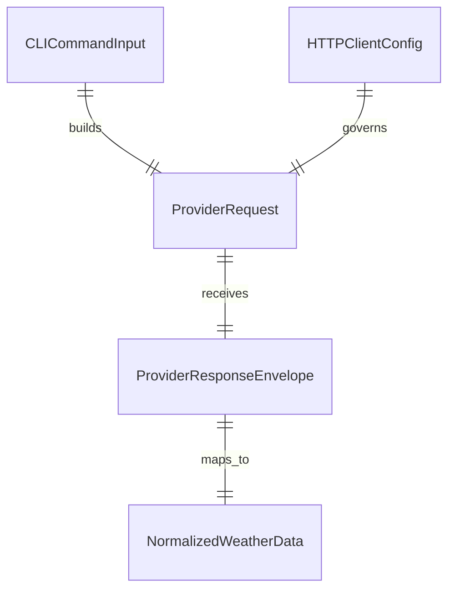

| Entity | Attributes (name: type, constraints) | Relationships | State Transitions |
|--------|--------------------------------------|---------------|-------------------|
| CLICommandInput | latitude: float64 REQUIRED range[-90,90], longitude: float64 REQUIRED range[-180,180], show_help: bool DEFAULT false, extra_args: []string MUST be empty for valid execution | builds: ProviderRequest, invokes: WeatherService | raw -> validated \| raw -> rejected |
| ProviderRequest | latitude: float64 REQUIRED, longitude: float64 REQUIRED, current_fields: []string FIXED[temperature_2m, wind_speed_10m, weather_code, time], endpoint: string HTTPS REQUIRED, timeout: duration FIXED 3s, retries: int FIXED 0 | built_from: CLICommandInput, sent_by: OpenMeteoProvider | assembled -> dispatched |
| ProviderResponseEnvelope | latitude: float64 REQUIRED, longitude: float64 REQUIRED, current: object REQUIRED, current_units: object OPTIONAL | returned_by: Open-Meteo API, mapped_to: NormalizedWeatherData | received -> parsed \| received -> parse_failed |
| NormalizedWeatherData | temperature: float64 REQUIRED, wind_speed: float64 REQUIRED, weather_code: int REQUIRED, observation_time: string REQUIRED RFC3339/provider timestamp | returned_by: WeatherService | normalized -> returned |
| HTTPClientConfig | timeout: duration FIXED 3s, follow_redirects: bool DEFAULT true, retry_policy: string FIXED none | used_by: OpenMeteoProvider | configured |

ER Diagram (visual reference)

