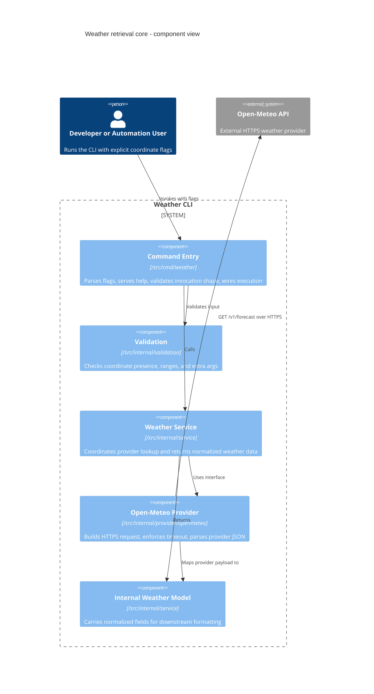

# Implementation Plan: Weather retrieval core

**Branch**: `00001-weather-retrieval-core` | **Date**: 2026-04-02 | **Spec**: `specs/00001-weather-retrieval-core/spec.md`

## Summary

**Goal**: Establish the runnable Go CLI foundation under `/src` for coordinate-based current weather retrieval through a provider abstraction.  
**Approach**: Use a standard-library-first command flow with strict flag validation, a timeout-bounded Open-Meteo adapter, and deterministic unit/integration tests.  
**Key Constraint**: Preserve a small modular CLI under `/src` without exposing raw provider payloads or introducing persistence.

## Technical Context

**Language/Version**: Go 1.24  
**Primary Dependencies**: Go standard library (`flag`, `net/http`, `encoding/json`, `context`, `time`), Open-Meteo HTTPS API  
**Storage**: N/A  
**Testing**: `go test`, table-driven tests, `net/http/httptest`  
**Target Platform**: Local CLI runtime on Linux, macOS, and Windows  
**Project Type**: single  
**Project Mode**: greenfield  
**Performance Goals**: Successful provider-backed retrieval path completes within the 3-second outbound timeout budget under normal network conditions; local validation overhead remains negligible versus network latency.  
**Constraints**: Source code must live under `/src`; explicit named flags only; HTTPS-only outbound provider calls; no retries; no persistence; internal normalized weather data only in this epic.  
**Scale/Scope**: Single-user local execution, one command invocation per run, low concurrency, Open-Meteo current-weather baseline only.

## Instructions Check

| Gate | Status | Notes |
|------|--------|-------|
| Simplicity-First Modularity | PASS | Plan keeps command, validation, service, provider, and internal model boundaries separate. |
| Stable CLI Contracts | PASS | Plan preserves CLI-owned contracts by isolating provider payloads inside internal models and adapter code. |
| Test-Backed Delivery | PASS | Unit and integration testing are planned with `go test` and `httptest` for the touched behavior. |
| Automated Release Readiness | PASS | Plan keeps build/lint/test commands automatable for later CI wiring without introducing release-specific complexity here. |
| ENFORCE_SRC_ROOT | PASS | All implementation paths are planned under `/src`. |

## Architecture



## Architecture Decisions

| ID | Decision | Options Considered | Chosen | Rationale |
|----|----------|--------------------|--------|-----------|
| AD-001 | CLI parsing approach | Go `flag`; Cobra-style framework | Go `flag` | The MVP needs explicit flags and help behavior without subcommand or dependency overhead. |
| AD-002 | Provider integration boundary | Direct HTTP in command; service-owned HTTP client; provider interface + adapter | Provider interface + Open-Meteo adapter | Keeps upstream payload and transport details out of command orchestration and downstream contract work. |
| AD-003 | Timeout and retry policy | 3s no retry; 5s no retry; retry with backoff | 3s no retry | Matches clarified spec and preserves deterministic automation behavior. |
| AD-004 | Internal weather baseline | Temperature only; 4-field normalized model; broader provider mirror | 4-field normalized model | Satisfies E001 proof of normalization without prematurely freezing the public success contract. |
| AD-005 | Integration test strategy | Live Open-Meteo tests; mocked provider only; `httptest` adapter tests + unit mocks | `httptest` adapter tests + unit mocks | Covers request construction and parsing deterministically without network dependence. |

## Data Model Summary

| Entity | Key Fields | Relationships | Notes |
|--------|------------|---------------|-------|
| CLICommandInput | latitude, longitude, showHelp, extraArgs | feeds ProviderRequest, invokes WeatherService | Validation-owned transient input model |
| ProviderRequest | latitude, longitude, currentFields, timeout | built from CLICommandInput | HTTPS-only, no retries |
| ProviderResponseEnvelope | latitude, longitude, current, current_units | mapped into NormalizedWeatherData | Provider-specific JSON shape |
| NormalizedWeatherData | temperature, windSpeed, weatherCode, observationTime | returned by WeatherService | Internal-only model for downstream contract work |
| HTTPClientConfig | timeout, transportDefaults | used by OpenMeteoProvider | No persistence; one request per invocation |

**Detail**: `specs/00001-weather-retrieval-core/data-model.md`

## API Surface Summary

| Method | Path | Purpose | Auth | Req/Res Types |
|--------|------|---------|------|---------------|
| command | `weather --latitude <float> --longitude <float>` | Execute current-weather retrieval flow | none | `CLICommandInput` -> `NormalizedWeatherData` |
| command | `weather --help` | Show baseline invocation guidance | none | none -> usage text |
| outbound GET | `https://api.open-meteo.com/v1/forecast` | Retrieve provider weather payload | none | `ProviderRequest` -> `ProviderResponseEnvelope` |

**Detail**: `specs/00001-weather-retrieval-core/contracts/cli-command.md`

## Testing Strategy

| Tier | Tool | Scope | Mock Boundary | Install |
|------|------|-------|---------------|---------|
| Unit | `go test` | Validation rules, service orchestration, argument handling helpers | Mock provider interface; no network | bundled with Go |
| Integration | `go test` + `net/http/httptest` | Open-Meteo request construction, timeout wiring, provider response parsing, command-path execution against test doubles | In-process HTTP server replaces external provider | bundled with Go |
| Security | `govulncheck` | Codebase and resolved module graph for reachable known vulnerabilities | — | `go install golang.org/x/vuln/cmd/govulncheck@latest` |
| Coverage | `go test -coverprofile=coverage.out ./...` | Measure touched-package coverage against the 80% target | — | bundled with Go |

## Error Handling Strategy

| Error Category | Pattern | Response | Retry |
|----------------|---------|----------|-------|
| Validation | fail-fast | Return CLI-owned usage failure from command path before provider call; no outbound request | no |
| Downstream timeout | bounded timeout | Return provider-call failure to the command path with no provider payload leakage | no, fixed policy of none |
| Downstream malformed payload | parse-and-classify | Return internal provider parsing failure to command path for later error-contract mapping | no |
| Internal mapping | fail-fast | Return internal processing failure from service/provider seam for later CLI-owned handling | no |

## Risk Mitigation

| Risk (from spec) | Likelihood | Impact | Mitigation | Owner |
|-------------------|------------|--------|------------|-------|
| Provider payload variability | medium | medium | Limit requested fields, define narrow response structs, and cover parsing with fixture-style adapter tests. | `/src/internal/provider/openmeteo` |
| Validation ambiguity | low | high | Centralize coordinate and invocation-shape checks in a dedicated validation layer and test missing/range/extra-arg cases table-wise. | `/src/internal/validation` |
| Boundary drift | medium | medium | Keep provider types internal, return only normalized internal data from the service, and defer public success/error contracts to later epics. | `/src/internal/service` |

## Requirement Coverage Map

| Req ID | Component(s) | File Path(s) | Notes |
|--------|--------------|--------------|-------|
| FR-001 | command entry | `/src/cmd/weather/main.go`, `/src/cmd/weather/run.go` | Defines executable entry and named coordinate flags |
| FR-002 | command help | `/src/cmd/weather/main.go`, `/src/cmd/weather/usage.go` | Baseline `--help` output for invocation guidance |
| FR-003 | validation | `/src/internal/validation/coordinates.go`, `/src/cmd/weather/run.go` | Rejects missing required coordinates before provider use |
| FR-004 | validation | `/src/internal/validation/coordinates.go` | Enforces latitude/longitude range constraints |
| FR-005 | command validation | `/src/cmd/weather/run.go`, `/src/internal/validation/args.go` | Rejects malformed invocation shape and extra args |
| FR-006 | provider abstraction, service | `/src/internal/provider/provider.go`, `/src/internal/provider/openmeteo/client.go`, `/src/internal/service/weather.go` | Command path depends on provider interface, not raw HTTP |
| FR-007 | provider transport | `/src/internal/provider/openmeteo/client.go` | Enforces HTTPS endpoint, 3-second timeout, and no retries |
| FR-008 | provider mapping, service model | `/src/internal/provider/openmeteo/response.go`, `/src/internal/service/weather.go` | Produces normalized internal weather data with the 4 clarified fields |
| FR-009 | tests | `/src/cmd/weather/main_test.go`, `/src/internal/validation/coordinates_test.go`, `/src/internal/provider/openmeteo/client_test.go`, `/src/internal/service/weather_test.go` | Covers parsing, validation, request construction, and response parsing |

## Project Structure

### Source Code

```text
/src/
  /cmd/
    /weather/
      main.go
      run.go
      usage.go
      main_test.go
  /internal/
    /provider/
      provider.go
      /openmeteo/
        client.go
        request.go
        response.go
        client_test.go
    /service/
      weather.go
      weather_test.go
    /validation/
      coordinates.go
      args.go
      coordinates_test.go
```

## Implementation Hints

- **[HINT-001]** Order: Define the provider interface and normalized weather model before wiring the command path so service and tests share one boundary.
- **[HINT-002]** Constraint: Keep Open-Meteo request/response structs inside the adapter package to avoid leaking provider semantics into later public contracts.
- **[HINT-003]** Gotcha: `flag` parsing stops at the first non-flag argument, so explicit extra-argument checks are required after parsing.
- **[HINT-004]** Performance: Reuse a configured `http.Client` with a 3-second timeout instead of per-call transport customization spread across packages.
- **[HINT-005]** Compatibility: Keep help behavior stable now, but leave version wiring out of E001 so later release/version work can add it without reworking the command seam.
