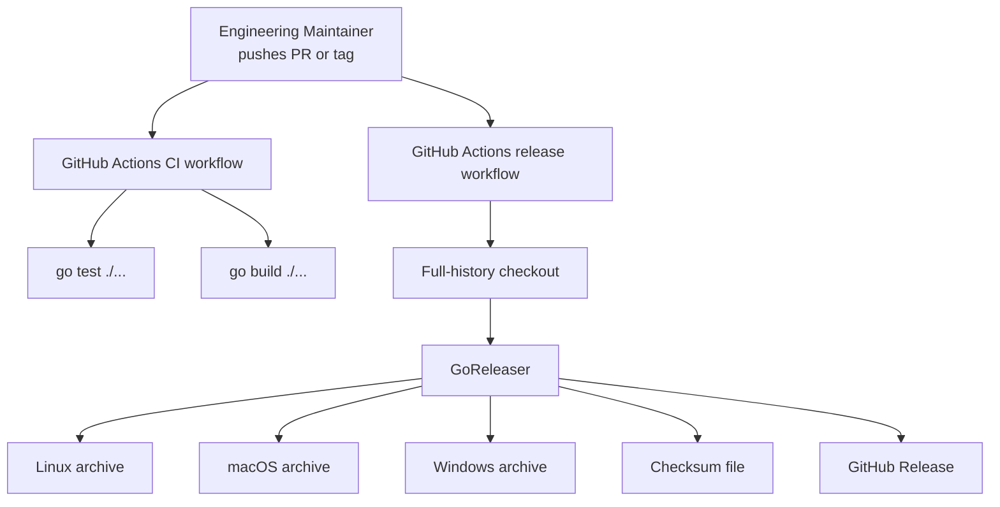

# Implementation Plan: Release automation

**Branch**: `[00002-release-automation]` | **Date**: 2026-04-02 | **Spec**: `specs/00002-release-automation/spec.md`

## Summary

**Goal**: Add repository automation that validates the CLI on changes and publishes tagged multi-platform releases through GitHub Actions and GoReleaser.  
**Approach**: Introduce repository-level workflow files plus a GoReleaser configuration that packages the existing Go CLI entrypoint for Linux, macOS, and Windows.  
**Key Constraint**: Release automation must use GitHub Actions and GoReleaser without changing the current `/src` application layout.

## Technical Context

**Language/Version**: Go 1.24  
**Primary Dependencies**: Go standard library, GitHub Actions workflow runtime, GoReleaser  
**Storage**: N/A  
**Testing**: `go test ./...`, `go build ./...`, workflow/config validation by repository checks  
**Target Platform**: GitHub-hosted Linux runners for automation; packaged artifacts for Linux, macOS, and Windows  
**Project Type**: single  
**Project Mode**: brownfield  
**Performance Goals**: CI validation should complete on standard hosted runners using the current Go test/build baseline; release packaging should generate all target archives in one tagged workflow run  
**Constraints**: Preserve `/src` source layout, use GitHub Actions plus GoReleaser, publish deterministic archives and checksums, keep release configuration extensible for future signing/SBOM additions  
**Scale/Scope**: One repository, one CLI binary, one CI workflow, one tag-triggered release workflow

## Instructions Check

*GATE: Must pass before Phase 0 research. Re-check after Phase 1 design.*

- PASS — repository-level config stays at root and leaves `/src` unchanged
- PASS — validation commands remain automatable through GitHub Actions
- PASS — test-backed delivery is preserved by running `go test ./...` and `go build ./...` in CI
- PASS — no project-instructions conflicts detected in the planned design

## Architecture



## Architecture Decisions

| ID | Decision | Options Considered | Chosen | Rationale |
|----|----------|--------------------|--------|-----------|
| AD-001 | CI workflow trigger scope | push only / pull_request only / push + pull_request | push + pull_request | Covers default branch changes and review paths with the same validation commands |
| AD-002 | Release packaging strategy | handwritten matrix archives / GoReleaser | GoReleaser | Aligns with ADR-005 and reduces custom packaging logic |
| AD-003 | Artifact naming policy | platform-default names / deterministic templated names | deterministic templated names | Satisfies release acceptance criteria and simplifies downstream consumption |

## Data Model Summary

N/A — no persistent data

## API Surface Summary

N/A — no API surface

## Testing Strategy

| Tier | Tool | Scope | Mock Boundary | Install |
|------|------|-------|---------------|---------|
| Unit | `go test ./...` | Existing Go package tests exercised by CI | Provider/network already mocked in package tests | configured |
| Integration | `go build ./...` | Verifies the CLI binary entrypoint and package graph compile in CI | No external publishing | configured |
| Security | `govulncheck ./...` | Repository vulnerability scan during QC and optional CI extension | — | `go install golang.org/x/vuln/cmd/govulncheck@latest` |
| Coverage | `go test -coverprofile=coverage.out ./...` | Measures repository coverage during QC | — | configured |

## Error Handling Strategy

| Error Category | Pattern | Response | Retry |
|----------------|---------|----------|-------|
| CI validation failure | fail-fast | Workflow job fails before release publication | no |
| Release packaging failure | fail-fast in tagged workflow | Release job fails with GoReleaser output in Actions logs | no |
| Artifact naming/config drift | configuration review plus CI validation | Fix repository config and rerun workflow | no |

## Integration Points

| Spec Reference | System/Service | Technical Approach | Contract |
|----------------|----------------|--------------------|----------|
| IP-001 | Existing Go CLI module | Build and test the current repository module and `/src/cmd/weather` entrypoint | `go test ./...`, `go build ./...` |
| IP-002 | GitHub Actions / GitHub Releases | Workflow YAML triggers validation and tag-based publication | `.github/workflows/*.yml` |
| IP-003 | GoReleaser | Repository root config defines builds, archives, checksums, and release behavior | `.goreleaser.yaml` |

## Risk Mitigation

| Risk (from spec) | Likelihood | Impact | Mitigation | Owner |
|-------------------|------------|--------|------------|-------|
| Workflow drift | medium | medium | Keep CI commands aligned with existing local validation commands and reuse them consistently in workflows | repository automation |
| Packaging misconfiguration | medium | high | Keep GoReleaser config explicit for binary path, OS targets, archive naming, and checksums | release config |
| Future hardening pressure | low | medium | Structure workflows and GoReleaser config so signing/SBOM fields can be added without replacing the baseline flow | release config |

## Requirement Coverage Map

| Req ID | Component(s) | File Path(s) | Notes |
|--------|--------------|--------------|-------|
| OR-001 | CI workflow | `.github/workflows/ci.yml` | Run Go test and build on push and pull request events |
| OR-002 | Release workflow, GoReleaser config | `.github/workflows/release.yml`, `.goreleaser.yaml` | Tag-triggered publication through GoReleaser |
| OR-003 | GoReleaser build matrix | `.goreleaser.yaml` | Explicit Linux, macOS, and Windows targets |
| OR-004 | GoReleaser archives/checksums | `.goreleaser.yaml` | Deterministic archive and checksum output names |
| OR-005 | Workflow/build entrypoint wiring | `.github/workflows/ci.yml`, `.github/workflows/release.yml`, `.goreleaser.yaml` | Preserve current module and `/src` entrypoint |
| RR-001 | Maintainer-facing workflow structure | `.github/workflows/release.yml`, `specs/00002-release-automation/qc-report.md` | Trigger and validation flow remain explicit in config and QC evidence |
| RR-002 | Artifact naming definition | `.goreleaser.yaml` | Naming and checksum rules are centralized in one file |

## Project Structure

### Source Code

```text
~ .github/
  + workflows/
    + ci.yml
    + release.yml
+ .goreleaser.yaml
```

**Patterns to reuse**: keep repository config at root and preserve the existing Go module and `/src` layout.
**Tests to extend**: repository QC commands and existing Go test/build entrypoints.
**Naming conventions**: lower-case workflow file names, root-level YAML config for release automation.

## Implementation Hints

- **[HINT-001]** Workflow scope: keep CI and release publishing as separate workflows so pull requests never try to publish.
- **[HINT-002]** Checkout depth: release workflow must fetch full git history for GoReleaser tag-aware publication.
- **[HINT-003]** Entry point: package the existing `./src/cmd/weather` command rather than restructuring the module.
- **[HINT-004]** Artifact naming: set explicit archive names and checksum output to avoid platform-default drift.
- **[HINT-005]** Local verification: use `go test ./...`, `go build ./...`, `govulncheck ./...`, and `go test -coverprofile=coverage.out ./...` as the baseline verification commands.
