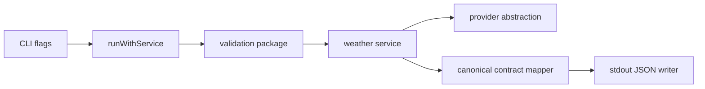

# Implementation Plan: Canonical weather JSON

**Branch**: `[00003-canonical-weather-json]` | **Date**: 2026-04-02 | **Spec**: `specs/00003-canonical-weather-json/spec.md`

## Summary

**Goal**: Replace the current ad hoc success output with a stable CLI-owned JSON contract written to stdout for successful weather lookups.  
**Approach**: Add a dedicated internal contract type and writer, map normalized service data into that contract in the command layer, and extend tests to verify valid JSON and stable field mapping.  
**Key Constraint**: Successful default output must remain stdout-only JSON and must not expose raw provider payload structure.

## Technical Context

**Language/Version**: Go 1.24  
**Primary Dependencies**: Go standard library JSON encoder, existing provider/service packages  
**Storage**: N/A  
**Testing**: `go test ./...`, targeted command tests, contract-focused assertions  
**Target Platform**: Cross-platform Go CLI under `/src`  
**Project Type**: single  
**Project Mode**: brownfield  
**Performance Goals**: negligible serialization overhead relative to existing single-response CLI execution  
**Constraints**: preserve `/src` source layout, keep success stdout machine-readable, avoid leaking provider-specific schema, prefer additive contract evolution  
**Scale/Scope**: one CLI command, one canonical success contract, one command success writer path

## Instructions Check

*GATE: Must pass before Phase 0 research. Re-check after Phase 1 design.*

- PASS — source changes remain under `/src`
- PASS — CLI contract ownership is preserved in the command/contract layer
- PASS — test-backed delivery will cover the touched success behavior
- PASS — no project-instructions conflicts detected in the planned design

## Architecture



## Architecture Decisions

| ID | Decision | Options Considered | Chosen | Rationale |
|----|----------|--------------------|--------|-----------|
| AD-001 | Public success contract location | reuse provider struct / add dedicated contract package | dedicated contract package | Prevents leakage of provider or internal types into the public CLI surface |
| AD-002 | JSON emission path | inline map encoding in command / dedicated writer helper | dedicated writer helper | Keeps output behavior testable and explicit |
| AD-003 | Contract verification scope | only unit tests / command + parseability tests | command + parseability tests | Verifies the real stdout behavior consumed by scripts |

## Data Model Summary

N/A — no persistent data

## API Surface Summary

N/A — no API surface

## Testing Strategy

| Tier | Tool | Scope | Mock Boundary | Install |
|------|------|-------|---------------|---------|
| Unit | `go test ./...` | Contract mapping and writer behavior | Stub weather service in command tests | configured |
| Integration | `go test ./...` | Command success path with stdout/stderr assertions | Provider/network mocked at weather getter seam | configured |
| Security | N/A | N/A | — | N/A |
| Coverage | `go test -coverprofile=coverage.out ./...` | Measure touched package coverage during QC | — | configured |

## Error Handling Strategy

N/A — E002 focuses on successful output only; structured failure contracts remain in E003.

## Integration Points

| Spec Reference | System/Service | Technical Approach | Contract |
|----------------|----------------|--------------------|----------|
| Existing E001 output path | `src/cmd/weather/run.go` | Replace `%+v` success formatting with canonical JSON writer | stdout JSON payload |
| Internal normalized data | `src/internal/provider/provider.go` and service layer | Map normalized weather data into CLI-owned fields | dedicated success contract type |
| Test harness | `src/cmd/weather/main_test.go` | Extend existing stubbed command tests to assert JSON parseability and field stability | parsed JSON assertions |

## Risk Mitigation

| Risk (from spec) | Likelihood | Impact | Mitigation | Owner |
|-------------------|------------|--------|------------|-------|
| Contract leakage | medium | high | Add a separate contract package and avoid encoding provider structs directly | command/contract layer |
| Silent breaking change | medium | high | Add tests for exact canonical keys and value mapping | command tests |
| Output contamination | low | medium | Assert stderr is empty on success and stdout parses cleanly as JSON | command tests |

## Requirement Coverage Map

| Req ID | Component(s) | File Path(s) | Notes |
|--------|--------------|--------------|-------|
| FR-001 | Success contract type | `src/internal/contract/success.go` | Define CLI-owned response schema |
| FR-002 | Command success writer | `src/cmd/weather/run.go`, `src/internal/contract/success.go` | Emit parseable JSON to stdout only |
| FR-003 | Mapping layer | `src/internal/contract/success.go`, `src/cmd/weather/run.go` | Normalize internal values into canonical fields |
| FR-004 | Command and contract tests | `src/cmd/weather/main_test.go` | Verify parseability and stable field mapping |

## Project Structure

### Source Code

```text
~ src/
  ~ cmd/
    ~ weather/
      ~ run.go
      ~ main_test.go
  + internal/
    + contract/
      + success.go
```

**Patterns to reuse**: keep the command layer thin and test through the existing injected weather getter seam.
**Tests to extend**: `src/cmd/weather/main_test.go` success-path tests.
**Naming conventions**: lower-case internal package names, explicit JSON tags, stable CLI-owned field names.

## Implementation Hints

- **[HINT-001]** Contract boundary: do not marshal `provider.WeatherData` directly as the public CLI payload.
- **[HINT-002]** Stdout ownership: success JSON must be the only stdout content for the default command path.
- **[HINT-003]** Stderr cleanliness: success tests should assert stderr stays empty.
- **[HINT-004]** JSON stability: use explicit struct tags and exact key assertions in tests.
- **[HINT-005]** Newline handling: emit a single JSON document with a trailing newline for CLI friendliness.
