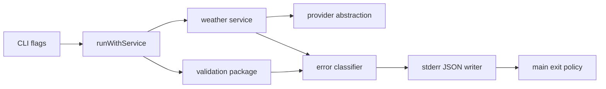

# Implementation Plan: Structured CLI errors

**Branch**: `[00004-structured-cli-errors]` | **Date**: 2026-04-02 | **Spec**: `specs/00004-structured-cli-errors/spec.md`

## Summary

**Goal**: Replace ad hoc failure output with a canonical stderr JSON contract and deterministic exit code policy for validation, downstream, provider, and internal failures.  
**Approach**: Add a CLI-owned error contract and classifier in the internal contract package, update the command flow to write structured errors to stderr, and make `main()` exit using a centralized policy.  
**Key Constraint**: Failure payloads must remain machine-readable on stderr only and must not contaminate stdout.

## Technical Context

**Language/Version**: Go 1.24  
**Primary Dependencies**: Go standard library JSON encoder, existing validation/service/provider packages  
**Storage**: N/A  
**Testing**: `go test ./...`, command failure-path tests, coverage command  
**Target Platform**: Cross-platform Go CLI under `/src`  
**Project Type**: single  
**Project Mode**: brownfield  
**Performance Goals**: negligible classification and serialization overhead relative to existing command execution  
**Constraints**: preserve `/src` layout, keep stdout clean on failure, use deterministic non-zero exit codes, avoid leaking unsafe raw provider/internal details  
**Scale/Scope**: one CLI command path, one canonical error contract, one exit code policy

## Instructions Check

*GATE: Must pass before Phase 0 research. Re-check after Phase 1 design.*

- PASS — source changes remain under `/src`
- PASS — CLI-owned output contracts remain in the internal contract layer
- PASS — failure behavior will be test-backed for touched command paths
- PASS — no project-instructions conflicts detected in the planned design

## Architecture



## Architecture Decisions

| ID | Decision | Options Considered | Chosen | Rationale |
|----|----------|--------------------|--------|-----------|
| AD-001 | Error contract location | inline command structs / internal contract package | internal contract package | Keeps public failure schema separate from command implementation details |
| AD-002 | Exit code ownership | fixed `os.Exit(1)` / category-based exit policy | category-based exit policy | Satisfies deterministic automation-facing failure semantics |
| AD-003 | Failure mapping boundary | pass raw errors through / centralized classifier | centralized classifier | Prevents drift and unsafe leakage across validation and provider failures |

## Data Model Summary

N/A — no persistent data

## API Surface Summary

N/A — no API surface

## Testing Strategy

| Tier | Tool | Scope | Mock Boundary | Install |
|------|------|-------|---------------|---------|
| Unit | `go test ./...` | Error contract mapping and exit code policy | Stub weather service errors in command tests | configured |
| Integration | `go test ./...` | Command failure paths with stdout/stderr assertions | Provider/network mocked at weather getter seam | configured |
| Security | N/A | N/A | — | N/A |
| Coverage | `go test -coverprofile coverage.out ./...` | Measure touched package coverage during QC | — | configured |

## Error Handling Strategy

| Error Category | Pattern | Response | Retry |
|----------------|---------|----------|-------|
| Validation | fail-fast before service call | canonical stderr JSON + usage exit code | no |
| Downstream transport | classify returned provider error | canonical stderr JSON + downstream exit code | no |
| Downstream provider | classify returned provider error | canonical stderr JSON + provider exit code | no |
| Internal | fallback for unmapped failures or write failures | canonical stderr JSON + internal exit code | no |

## Integration Points

| Spec Reference | System/Service | Technical Approach | Contract |
|----------------|----------------|--------------------|----------|
| Existing command path | `src/cmd/weather/run.go` | Intercept returned errors, classify them, and write structured stderr JSON | canonical error payload |
| Process exit semantics | `src/cmd/weather/main.go` | Replace fixed exit code with category-based exit policy | deterministic non-zero exit codes |
| Validation and provider surfaces | `src/internal/validation/*`, `src/internal/provider/openmeteo/client.go` | Map known validation and downstream failure messages to stable public categories | classifier rules |

## Risk Mitigation

| Risk (from spec) | Likelihood | Impact | Mitigation | Owner |
|-------------------|------------|--------|------------|-------|
| Category drift | medium | high | Centralize classification and assert categories in tests | contract layer |
| Information leakage | medium | high | Publish safe user-facing messages instead of raw implementation details when needed | command/contract layer |
| Stream contamination | low | medium | Assert stdout stays empty and stderr JSON parses in failure-path tests | command tests |

## Requirement Coverage Map

| Req ID | Component(s) | File Path(s) | Notes |
|--------|--------------|--------------|-------|
| FR-001 | Error contract type, classifier, writer | `src/internal/contract/error.go` | Define canonical error schema and categories |
| FR-002 | Validation classification and exit policy | `src/internal/contract/error.go`, `src/cmd/weather/run.go`, `src/cmd/weather/main.go` | Fail fast with deterministic exit mapping |
| FR-003 | Failure stderr emission | `src/internal/contract/error.go`, `src/cmd/weather/run.go`, `src/cmd/weather/main.go` | Structured stderr JSON with clean stdout |
| FR-004 | Failure-path tests | `src/cmd/weather/main_test.go` | Validation, provider, and internal failure verification |

## Project Structure

### Source Code

```text
~ src/
  ~ cmd/
    ~ weather/
      ~ main.go
      ~ run.go
      ~ main_test.go
  ~ internal/
    ~ contract/
      + error.go
```

**Patterns to reuse**: keep command flow thin and reuse the existing injected weather getter seam for failure-path tests.
**Tests to extend**: `src/cmd/weather/main_test.go`.
**Naming conventions**: lower-case internal package names, explicit JSON tags, stable CLI-owned categories and exit codes.

## Implementation Hints

- **[HINT-001]** Fail-fast validation: classify validation errors before any provider call is observed in tests.
- **[HINT-002]** Stream ownership: write canonical error JSON to stderr only and leave stdout empty on failure.
- **[HINT-003]** Exit policy: compute exit codes from canonical category mapping rather than raw error text in `main()`.
- **[HINT-004]** Safe messaging: avoid exposing raw provider internals directly when classifying downstream failures.
- **[HINT-005]** Fallback path: include an internal-error fallback for unexpected or serialization-related failures.
