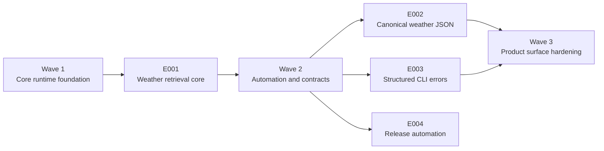

# Project Implementation Plan

Product: Weather CLI | Created: 2026-04-02 | Status: Draft | Total Epics: 4 (P1: 3, P2: 1, P3: 0) | Waves: 3

## Epic Checklist

### Wave 1 — Core runtime foundation

> Establish the runnable Go CLI skeleton under `/src`, integrate the initial weather provider, and create the reusable seams needed for downstream contract and error work.

- [X] E001 [P1] [PRODUCT] {PRD:CAP-001}{SAD:ADR-001}{SAD:ADR-002}{SAD:ADR-004} Weather retrieval core — Build the Go CLI foundation under `/src` with explicit flags, Open-Meteo integration, provider abstraction, and baseline command execution.

### Wave 2 — Automation and contracts

> Establish release automation after the core runtime exists, while parallel contract work turns the provider integration into a stable automation-facing CLI surface.

- [ ] E002 [P1] [PRODUCT] {PRD:CAP-002}{SAD:ADR-003} Canonical weather JSON — Normalize provider responses into a stable success schema and emit machine-readable JSON on stdout.
- [ ] E003 [P1] [PRODUCT] [P] {PRD:CAP-004}{SAD:ADR-003}{SAD:ADR-004} Structured CLI errors — Define validation, downstream, and internal error contracts with stable stderr JSON and exit-code behavior.
- [X] E004 [P2] [OPERATIONAL] [P] {PRD:CAP-005}{SAD:ADR-005} Release automation — Add GitHub Actions and GoReleaser automation for Linux, macOS, and Windows release artifacts.

### Wave 3 — Product surface hardening

> Finalize the stable user-facing success and error behaviors on top of the released build and test automation foundation.

## Dependency Diagram

## Execution Wave Summary

| Wave | Epics | All Parallel? | Notes |
|------|-------|---------------|-------|
| Wave 1 | E001 | No | Single foundation epic establishes `/src` structure, provider integration, and command flow. |
| Wave 2 | E002, E003, E004 | Yes | All three epics depend on E001 and can proceed in parallel once the runtime, provider seam, and test command baseline exist. |
| Wave 3 | None | N/A | No additional epics remain after Wave 2; the final milestone is completion and QC convergence across the parallel tracks. |

## Parallel Execution Guidance

### Independent Epics

- **E002 and E003**: can run in parallel after E001 because one owns the success contract and the other owns error behavior.
- **E004**: can also run in parallel after E001 because release automation can be scaffolded from the core command and test entrypoints without waiting for the final success and error contract details.

### Integration Risks

- **Contract drift**: E002 and E003 may define overlapping output conventions unless a shared contract package and versioning rule are established first.
- **Command-surface instability**: changes to flags or execution flow in E001 after Wave 2 starts can force rework in both downstream epics.
- **Release coupling**: E004 depends on stable command usage, artifact naming, and test commands from E001 and may need minor follow-up adjustments once E002 and E003 finalize the public contract surface.

### Shared Resource Conflicts

- **`/src/cmd` entrypoints**: E002 and E003 must avoid conflicting edits to the top-level execution path.
- **`/src/internal/contract`**: success and error schema ownership should be partitioned clearly.
- **CI workflow files**: E004 should be the sole owner of `.github/workflows/*` and `.goreleaser.yaml` while other epics provide the commands and behaviors those workflows invoke.

## Epic Details

### E001 — Weather retrieval core

- **Category**: PRODUCT
- **Priority**: P1
- **Source**: {PRD:CAP-001}{SAD:ADR-001}{SAD:ADR-002}{SAD:ADR-004}
- **Scope**: Deliver a working Go CLI foundation under `/src` that accepts explicit latitude and longitude flags, validates invocation shape, and retrieves current weather from Open-Meteo through a provider abstraction. This epic establishes the runnable application boundary, package structure, command entrypoint, timeout-aware HTTP integration, and baseline tests needed for all later product behavior.
- **Actors**: Developer or automation user, Open-Meteo API, engineering maintainer
- **Key entities**: CLI command input, provider request, provider response envelope, weather service, HTTP client configuration
- **Depends on**: None
- **Dependency contracts**: None
- **Depended on by**: E002, E003, E004
- **Produces (shared)**: `/src/cmd` command entrypoint, `/src/internal/provider/openmeteo`, `/src/internal/service`, provider abstraction, request timeout policy, baseline test harness
- **Constraints**: Must keep all source under `/src`; must use explicit named flags; must not expose raw provider behavior as the final public contract; must avoid persistent storage
- **Acceptance criteria**:
  - [ ] A runnable Go CLI entrypoint exists under `/src` and accepts explicit latitude and longitude flags.
  - [ ] The application validates required coordinates before performing any outbound request.
  - [ ] A provider abstraction exists with an initial Open-Meteo implementation using bounded HTTPS timeouts.
  - [ ] A successful provider call reaches the service layer and returns internal normalized weather data suitable for downstream contract formatting.
  - [ ] Unit and integration-oriented tests cover flag parsing, validation boundaries, provider request construction, and provider response parsing.
- **Specify input**:
  - **Description**: Build the initial Go CLI runtime and provider integration for coordinate-based current weather retrieval.
  - **Actors**: Developer or automation user, Open-Meteo API
  - **Key entities**: CLI flags, weather service, provider adapter, HTTP client
  - **Depends on artifacts**: `specs/prd.md`, `specs/sad.md`
  - **Constraints**: Go implementation under `/src`; explicit flags; Open-Meteo baseline; no persistence

### E002 — Canonical weather JSON

- **Category**: PRODUCT
- **Priority**: P1
- **Source**: {PRD:CAP-002}{SAD:ADR-003}
- **Scope**: Define and implement the CLI-owned canonical success response contract and map internal weather data into stable JSON output written to stdout. This epic converts provider-specific data into the public automation surface and folds in contract-focused tests rather than relying on a separate quality epic.
- **Actors**: Developer or automation user, downstream shell scripts, engineering maintainer
- **Key entities**: Canonical success contract, output writer, normalized weather payload, JSON schema versioning expectations
- **Depends on**: E001
- **Dependency contracts**: Needs provider abstraction, internal normalized weather data, and command execution flow from E001
- **Depended on by**: None
- **Produces (shared)**: `/src/internal/contract` success schema, stdout JSON writer, contract tests, example payload fixtures
- **Constraints**: Output contract must be CLI-owned and stable; successful command output must be valid parseable JSON on stdout only; changes should favor additive evolution
- **Acceptance criteria**:
  - [ ] A canonical success JSON contract is defined independently from the raw provider schema.
  - [ ] The CLI emits success payloads to stdout only, with no diagnostic contamination in default mode.
  - [ ] Provider-derived values are normalized consistently into the documented success contract.
  - [ ] Contract and integration tests verify valid parseable JSON and stable field mapping for successful requests.
- **Specify input**:
  - **Description**: Define the public JSON success contract for Weather CLI and map provider data into that stable stdout response.
  - **Actors**: Automation users and scripts consuming CLI output
  - **Key entities**: Success contract, JSON writer, normalized weather payload
  - **Depends on artifacts**: E001 provider abstraction and service outputs, `specs/prd.md`, `specs/sad.md`
  - **Constraints**: Contract must not mirror raw provider JSON directly; stdout must stay machine-readable

### E003 — Structured CLI errors

- **Category**: PRODUCT
- **Priority**: P1
- **Source**: {PRD:CAP-004}{SAD:ADR-003}{SAD:ADR-004}
- **Scope**: Define deterministic error categories and CLI failure behavior for validation issues, transport failures, provider failures, and internal faults. This epic adds structured stderr JSON, stable exit-code rules, and automated tests for failure-path behavior.
- **Actors**: Developer or automation user, shell scripts, engineering maintainer
- **Key entities**: Canonical error contract, exit code policy, validation errors, downstream errors, internal errors
- **Depends on**: E001
- **Dependency contracts**: Needs command execution path, validation hooks, and provider error surfaces from E001
- **Depended on by**: None
- **Produces (shared)**: `/src/internal/contract` error schema, exit-code mapping, stderr writer behavior, failure-path fixtures and tests
- **Constraints**: Error output must be stable and machine-readable; stderr must be used for failure payloads; no raw provider internals should leak unsafely
- **Acceptance criteria**:
  - [ ] A canonical error JSON contract exists for validation, downstream transport, provider, and internal failures.
  - [ ] Invalid input fails fast before network activity and returns a deterministic non-zero exit code.
  - [ ] Downstream and internal failures are emitted to stderr as structured JSON without corrupting stdout.
  - [ ] Tests cover validation errors, timeout/network failures, provider-response failures, and internal serialization or mapping faults.
- **Specify input**:
  - **Description**: Define Weather CLI failure behavior with structured stderr JSON and stable exit-code semantics for automation users.
  - **Actors**: Automation users, shell scripts, maintainers
  - **Key entities**: Error contract, exit codes, validation errors, provider failures
  - **Depends on artifacts**: E001 command flow and provider integration, `specs/prd.md`, `specs/sad.md`
  - **Constraints**: Failures must be machine-readable and separated from stdout; validation must fail before outbound requests

### E004 — Release automation

- **Category**: OPERATIONAL
- **Priority**: P2
- **Source**: {PRD:CAP-005}{SAD:ADR-005}
- **Scope**: Automate repeatable release builds and publishing for Linux, macOS, and Windows using GitHub Actions and GoReleaser. This epic packages the working CLI, runs the required test commands in CI, and publishes release artifacts with checksums.
- **Actors**: Engineering maintainer, GitHub Actions, end users downloading binaries
- **Key entities**: Release workflow, GoReleaser config, build matrix, archives, checksums, GitHub Release artifacts
- **Depends on**: E001
- **Dependency contracts**: Needs runnable command entrypoints, baseline test commands, version injection points, and deterministic binary naming conventions from E001
- **Depended on by**: None
- **Produces (shared)**: `.github/workflows/release.yml`, CI test workflow, `.goreleaser.yaml`, release artifact naming rules, checksums
- **Constraints**: Must target Linux, macOS, and Windows; must rely on GitHub Actions; must use GoReleaser for packaging; should preserve future room for signing and SBOM additions
- **Acceptance criteria**:
  - [X] GitHub Actions runs the project’s test command on repository changes and on release preparation paths.
  - [X] A tag-triggered release workflow uses GoReleaser to build and publish Linux, macOS, and Windows artifacts.
  - [X] Release outputs include archives and checksums with deterministic naming.
  - [X] Release automation documentation or workflow comments are sufficient for maintainers to cut a release reliably.
- **Specify input**:
  - **Description**: Add automated cross-platform packaging and GitHub release publishing for the working Weather CLI executable.
  - **Actors**: Engineering maintainer, GitHub Actions, end users
  - **Key entities**: Release workflow, GoReleaser config, release artifacts, checksums
  - **Depends on artifacts**: E001 command runtime and test baseline, `specs/sad.md`
  - **Constraints**: GitHub Actions plus GoReleaser only; Linux, macOS, and Windows targets required
  - **Pipeline hints**: `skip_clarify`, `skip_checklist`, `lightweight`

## Coverage Validation

### PRD Capability Coverage

| PRD Capability | Covered By | Notes |
|----------------|------------|-------|
| CAP-001 | E001 | Core coordinate-based retrieval and provider integration |
| CAP-002 | E002 | Stable machine-readable success output |
| CAP-003 | E001 | Help/version/explicit flags and core CLI usability are established in the foundation epic |
| CAP-004 | E003 | Structured failure behavior and operational resilience |
| CAP-005 | E004 | Cross-platform packaging and release automation |

### SAD ADR Coverage

| SAD ADR | Covered By | Notes |
|---------|------------|-------|
| ADR-001 | E001 | Go single-binary CLI baseline |
| ADR-002 | E001 | Open-Meteo provider integration |
| ADR-003 | E002, E003 | Canonical success and error contracts |
| ADR-004 | E001, E003 | Explicit flags and CLI behavior |
| ADR-005 | E004 | GitHub Actions and GoReleaser release automation |

### DOD Coverage

| DOD Item | Covered By | Notes |
|----------|------------|-------|
| N/A | N/A | No deployment and operations document is currently registered |

### Uncovered Items

- **None**: all PRD capabilities and implementation-relevant SAD ADRs are covered by at least one epic.

## Shared Artifact Surface

### Shared Data Entities

| Entity | Introduced By | Consumed By |
|--------|---------------|-------------|
| CLI command input | E001 | E002, E003 |
| Normalized weather payload | E001 | E002 |
| Success contract | E002 | None |
| Error contract | E003 | None |

### API Surfaces

| API Surface | Introduced By | Consumed By |
|-------------|---------------|-------------|
| Provider abstraction interface | E001 | E002, E003 |
| Open-Meteo client | E001 | E002, E003 |
| Success JSON output surface | E002 | None |
| Error JSON and exit-code surface | E003 | None |

### Libraries/Modules

| Library/Module | Introduced By | Consumed By |
|----------------|---------------|-------------|
| `/src/cmd` command layer | E001 | E002, E003 |
| `/src/internal/service` | E001 | E002, E003 |
| `/src/internal/provider/openmeteo` | E001 | E002, E003 |
| `/src/internal/contract` success types | E002 | None |
| `/src/internal/contract` error types | E003 | None |

## Wave Transition Protocol

- **Wave 1 -> Wave 2**: verify E001 has passed QC, `/src` structure is stable, provider abstraction is usable, the command execution path is available for contract work, and the baseline build and test commands are ready for CI wiring.
- **Wave 2 -> Wave 3**: verify E002, E003, and E004 have passed QC and any minor workflow adjustments needed for finalized contract behavior are complete.
- **Before any next wave**: confirm all prior-wave epics passed QC, shared artifacts are committed, dependency contracts remain satisfiable, and any technical context updates are reflected in the registered documents.
