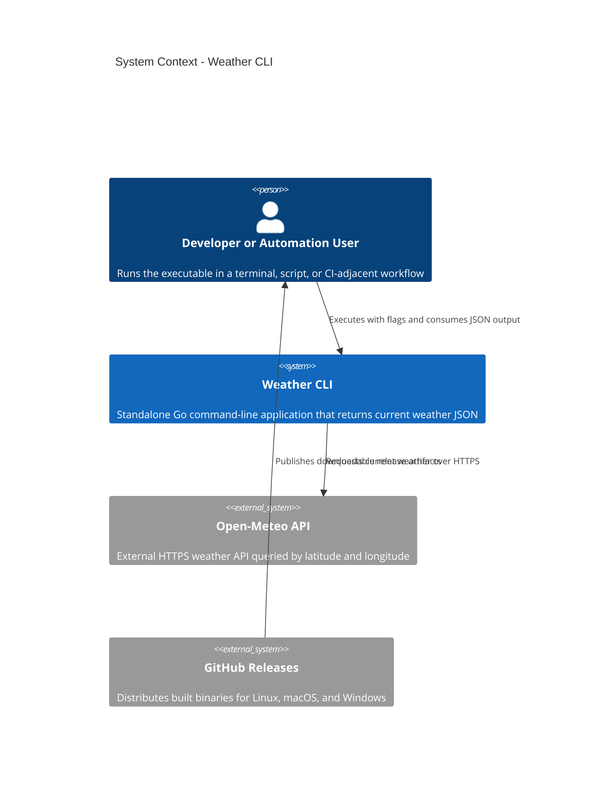
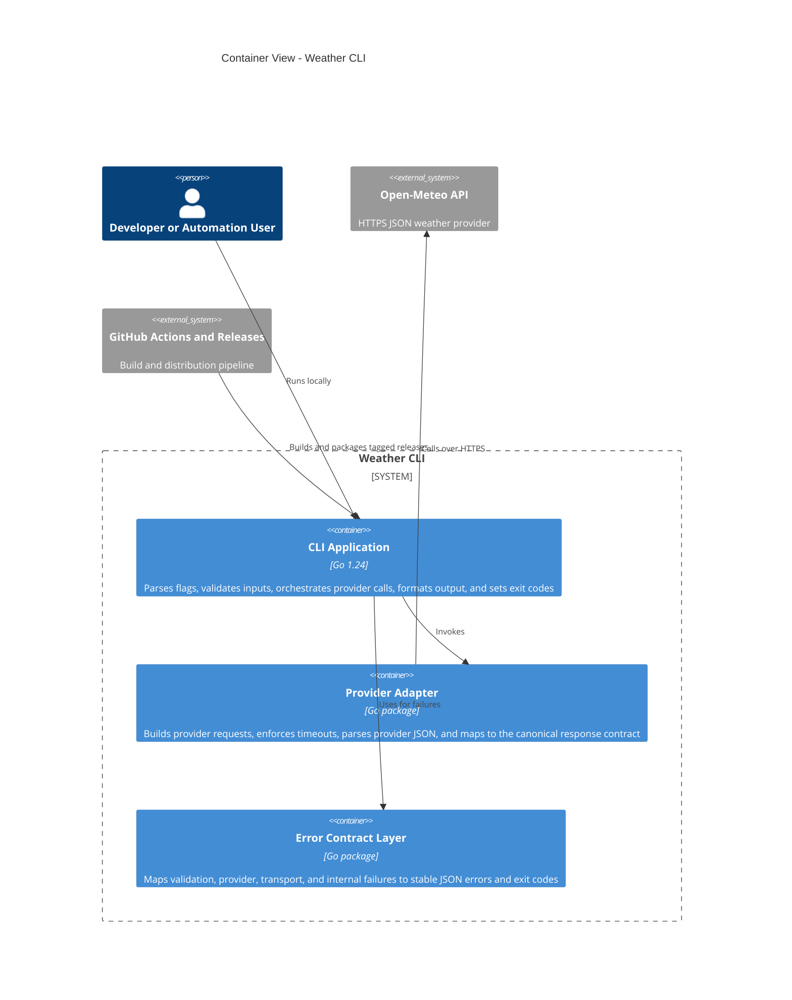
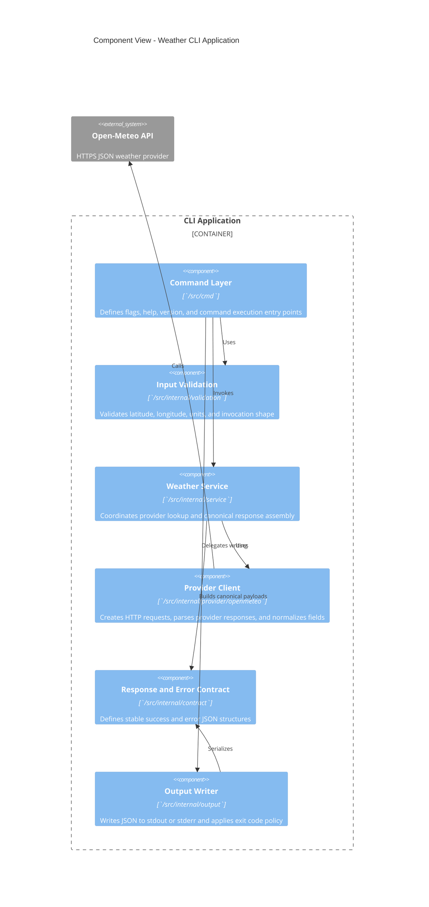
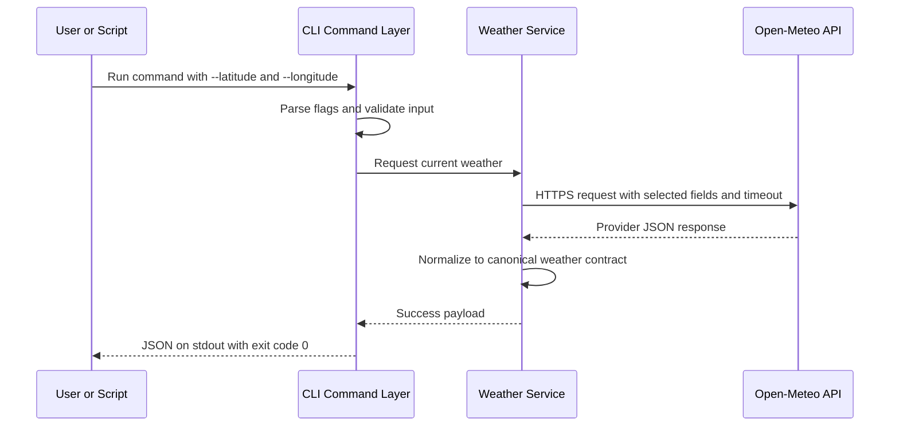
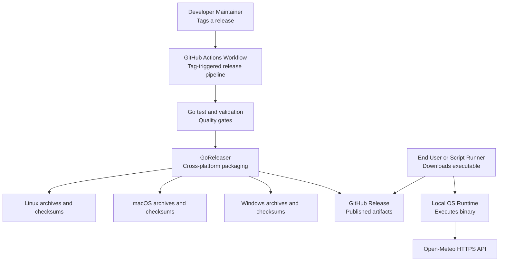

# Software Architecture Document: Weather CLI

> Date: 2026-04-02 | Status: Draft

## Purpose and Scope

Weather CLI is a standalone command-line application that retrieves current weather conditions for a supplied latitude and longitude and returns a stable JSON response. The system scope covers local CLI execution, external weather-provider integration, provider-response normalization, structured error handling, and automated packaging and release of executables for Linux, macOS, and Windows.

## Technical Context

**Language/Version**: Go 1.24 
**Primary Dependencies**: Go standard library, `flag` or `cobra`-style CLI layer, `net/http`, `encoding/json`, optional `go.uber.org/zap`-class structured logging kept minimal for CLI use, GoReleaser for packaging 
**Storage**: N/A  
**Testing**: `go test`, table-driven unit tests, HTTP test servers, integration tests for provider contract normalization 
**Target Platform**: Desktop and terminal CLI on Linux, macOS, and Windows  
**Project Type**: single service 
**Performance Goals**: Successful requests under 3 seconds in normal network conditions; local processing overhead under 100 ms excluding network latency  
**Constraints**: Standalone executable, JSON-first MVP, no persistent service, no required local database, external weather-provider dependency, all project source code under `/src`  
**Scale/Scope**: Single-user local execution, automation-friendly usage, low concurrency, global coordinate coverage via provider API

## System Scope and Context

The system boundary is a local executable invoked by a technical user or an automation script. The application accepts geocoordinates as CLI flags, validates inputs, calls a weather provider over HTTPS, maps the provider payload into a stable internal response contract, and writes JSON to stdout. Errors are returned as structured JSON to stderr with non-zero exit codes so shell scripts can distinguish success from failure.

Primary external systems are the chosen weather API provider and GitHub Releases for packaging and distribution. The architecture avoids persistence, background jobs, and hosted infrastructure in order to preserve the product’s single-purpose CLI nature.

### C4 System Context

### C4 Container View

### C4 Component View

## Solution Strategy and Architecture Style

- **Architecture Style**: Modular single-binary CLI
- **Source Code Location**: All project source code must reside in the `/src` directory.
- **Why this style fits**: the product is a small local executable with one primary use case, no persistence, and a strong need for clear package boundaries around CLI parsing, provider integration, normalization, and output policy.
- **Alternatives considered**: a hosted API plus thin client was rejected because it violates the standalone-product constraint; a single-file procedural CLI was rejected because it would make provider replacement, contract stability, and testing harder over time.

## Key Runtime Flows and Failure Paths

### Primary Flow

### Failure Paths

- Validation failure -> return canonical error JSON on stderr, print no success payload, exit with a dedicated non-zero usage code
- Network timeout or DNS failure -> return downstream transport error JSON, avoid retry storms in the MVP, exit non-zero
- Provider 4xx or malformed request -> classify as request/configuration failure, expose actionable reason when safe, exit non-zero
- Provider 5xx or unexpected payload shape -> classify as downstream provider failure, avoid leaking raw provider payloads, exit non-zero
- JSON serialization or internal mapping failure -> return internal error JSON, emit diagnostic logs only in debug mode, exit non-zero

## Deployment and Infrastructure View

## Cross-Cutting Concerns

### Security

The CLI has no user-authentication surface and stores no long-lived user data, but it crosses an external HTTPS trust boundary to retrieve weather data. The design should enforce HTTPS-only provider calls, bounded request timeouts, sanitized error messages, and no secrets in the binary by default. If future providers require API keys, secrets must be supplied through environment variables or secure CI secrets and never embedded in source or release artifacts.

### Reliability

The CLI should fail fast on invalid inputs before any network call. Network calls should use explicit client timeouts and a small, controlled retry policy of none for the MVP to avoid duplicate latency and unpredictable automation behavior. Provider failures should be normalized into stable error categories so users can make deterministic shell decisions. The system target is practical reliability for single-shot CLI usage rather than high-availability service uptime.

### Observability

Default mode should keep output minimal and machine-friendly. Success output should be canonical JSON to stdout only. Error JSON should go to stderr. Optional debug mode may emit request identifiers, provider endpoint details, and timing diagnostics to stderr without contaminating stdout. Release pipeline observability should rely on GitHub Actions logs, test output, and generated checksums.

### Data Management

The MVP keeps no persistent state, local cache, or database. All weather data is ephemeral request/response data held in memory for the lifetime of a single command invocation. No backups or migrations are required. If caching is introduced later, it should remain optional and must not alter the default deterministic output contract.

### Integration Strategy

Use a provider abstraction with a single initial implementation for Open-Meteo. The abstraction boundary should separate canonical domain fields from provider-specific fields so the provider can be swapped later without breaking CLI consumers. The provider adapter should request only the minimum weather fields needed for the canonical response and should shield the CLI from provider response-shape changes as much as possible.

### Operations

Operational ownership is lightweight: maintain source, tests, and release automation in GitHub. Use GitHub Actions to run tests on pushes and to produce tagged releases. Use GoReleaser to generate archives, checksums, and release metadata for Linux, macOS, and Windows. Optional future hardening can add signing, SBOM generation, and package-manager publishing once the binary contract stabilizes.

## Quality Attributes

| Attribute | Target | Measurement | Notes |
|-----------|--------|-------------|-------|
| Performance | Successful request completes in under 3 seconds under normal network conditions | Integration timing checks and manual validation against provider API | Excludes extraordinary provider outages |
| Reliability | At least 95% success for valid requests during MVP validation | Repeated integration runs with known-good coordinates | Dependent on provider availability |
| Security | No embedded secrets, HTTPS-only provider calls, sanitized error output | Code review, tests, and release artifact inspection | API-key handling deferred unless provider changes |
| Maintainability | Provider replacement and output evolution isolated to dedicated packages | Package-boundary review and unit-test coverage around normalization | Contract-first design is the key lever |
| Scalability | Support repeated local CLI usage without shared state contention | Sequential and repeated local invocation testing | Designed for local command execution, not server scale |

## Architecture Decisions

### ADR-001: Use Go for a single-binary CLI

- **Status**: Accepted
- **Context**: The product must ship as a standalone executable for Linux, macOS, and Windows with minimal runtime dependencies.
- **Decision**: Use Go as the implementation language and produce a single compiled binary per target platform.
- **Rationale**: Go has strong support for static binaries, standard-library networking and JSON handling, simple cross-compilation, and idiomatic CLI packaging.
- **Alternatives Considered**: Python was rejected because executable packaging is typically heavier; Node.js was rejected because runtime dependency management is less aligned with the single-binary goal; Rust was rejected because it adds implementation complexity for an MVP.
- **Tradeoffs**: Faster delivery and simpler release engineering over maximal low-level control.
- **Consequences**: The architecture should remain idiomatic Go, with clear packages and standard-library-first choices where feasible.

### ADR-002: Use Open-Meteo as the initial weather provider

- **Status**: Accepted
- **Context**: The MVP needs a coordinate-based JSON weather source with low integration friction and global coverage.
- **Decision**: Use Open-Meteo as the initial provider behind a provider abstraction.
- **Rationale**: Open-Meteo supports latitude/longitude queries, JSON responses, broad coverage, and documents stable parameter evolution expectations with no new required parameters for API stability.
- **Alternatives Considered**: OpenWeatherMap and WeatherAPI were rejected for the MVP baseline because they more commonly introduce API-key and account-management concerns; weather.gov was rejected because its strongest fit is narrower geography and inconsistent global applicability.
- **Tradeoffs**: Simpler onboarding and lower setup friction over stronger vendor lock-in protection from day one.
- **Consequences**: The internal response contract must not mirror Open-Meteo too directly, so provider replacement remains feasible.

### ADR-003: Define a canonical JSON output contract independent of the provider payload

- **Status**: Accepted
- **Context**: CLI consumers need stable machine-readable output even if the provider schema evolves or is swapped.
- **Decision**: Normalize provider responses into a canonical success contract and a canonical error contract owned by the CLI.
- **Rationale**: This protects downstream scripts from upstream schema churn and makes testing deterministic.
- **Alternatives Considered**: Passing through raw provider JSON was rejected because it leaks provider coupling into the public CLI surface; mixed raw-plus-normalized output was rejected because it creates ambiguity.
- **Tradeoffs**: Slightly more mapping logic in exchange for long-term stability and portability.
- **Consequences**: The implementation must version and document the output schema carefully, and future changes should prefer additive evolution.

### ADR-004: Use explicit flags as the primary CLI interface

- **Status**: Accepted
- **Context**: The CLI is intended for direct human invocation and automation-friendly scripting.
- **Decision**: Accept latitude and longitude through explicit named flags, with standard help and version flags and JSON output as the default MVP mode.
- **Rationale**: Named flags are clearer, more extensible, and more consistent with modern CLI guidelines than positional arguments for heterogeneous inputs.
- **Alternatives Considered**: Positional latitude/longitude arguments were rejected because they are less self-describing and harder to extend; config-file-first invocation was rejected because it adds friction to a simple utility.
- **Tradeoffs**: Slightly more typing for humans in exchange for clarity and future-proofing.
- **Consequences**: The command layer should reserve standard flags and keep the top-level interface narrow and stable.

### ADR-005: Use GitHub Actions with GoReleaser for release automation

- **Status**: Accepted
- **Context**: The project needs automated cross-platform releases for Linux, macOS, and Windows via GitHub.
- **Decision**: Trigger tagged releases in GitHub Actions and delegate build, archive, checksum, and release publication steps to GoReleaser.
- **Rationale**: GoReleaser is purpose-built for multi-platform release engineering, works cleanly with GitHub Actions, and supports future signing, SBOM generation, and package-manager publishing.
- **Alternatives Considered**: Handwritten matrix workflows were rejected because they add maintenance burden; local manual releases were rejected because they are error-prone and hard to reproduce.
- **Tradeoffs**: Introduces a dedicated release tool in exchange for simpler, repeatable packaging and distribution.
- **Consequences**: The repository will need a `.goreleaser.yaml` and a tag-based GitHub Actions workflow with full git history during release jobs.

## Risks, Assumptions, Constraints, and Open Questions

### Risks

- Open-Meteo response semantics for “current weather” may differ from user expectations unless the canonical fields are narrowly defined.
- Provider outages or rate controls can reduce CLI reliability despite correct local behavior.
- Future desire for human-readable output could pressure the contract design if output responsibilities are not isolated early.
- Cross-platform packaging details such as notarization or signing can expand release complexity beyond the MVP.

### Assumptions

- Go 1.24 is acceptable as the project baseline.
- Open-Meteo remains acceptable for MVP usage and licensing/attribution expectations.
- Users prefer a stable CLI-owned JSON contract over raw provider payloads.
- GitHub is the authoritative source for release artifacts.

### Constraints

- The system must remain a standalone CLI executable, not a hosted service.
- The MVP must return current weather in JSON format only.
- No persistent data store should be introduced for the MVP.
- Source code must be organized under `/src`.

### Open Questions

- What exact canonical success fields should be guaranteed in v1 of the JSON contract?
- Should units be fixed for v1 or exposed as a controlled optional flag?
- Should the initial CLI framework use the Go standard `flag` package or a structured command framework such as Cobra?
- When should release hardening add signing, SBOMs, Homebrew, Scoop, or Winget distribution?

## Project Context Baseline Updates

- Canonical technical context for downstream phases should be `specs/sad.md`.
- Recommended initial stack is Go 1.24, Open-Meteo integration, and GitHub Actions with GoReleaser for release automation.
- The public CLI surface should expose a CLI-owned canonical JSON contract rather than raw provider JSON.
- All project source code should live under `/src` with package boundaries for command handling, provider integration, contracts, and output policy.
- The E001 planning baseline uses Go standard-library-first flag parsing for the initial CLI command surface, with heavier CLI frameworks deferred unless later scope justifies them.
- Provider-facing integration tests should prefer `go test` with `net/http/httptest` over live network calls to keep validation deterministic.
- Recommended Go quality baseline is `golangci-lint` for linting, `govulncheck` for vulnerability scanning, and coverage measurement via `go test -coverprofile`.
